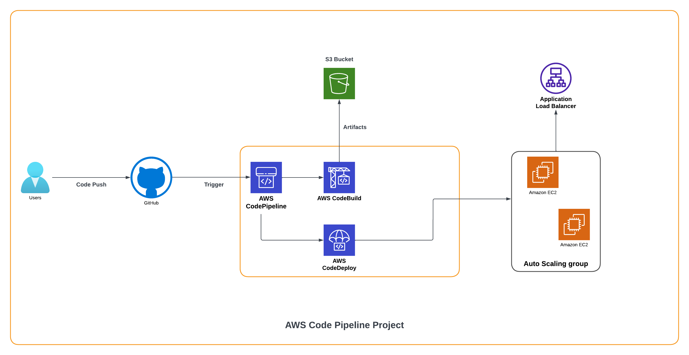
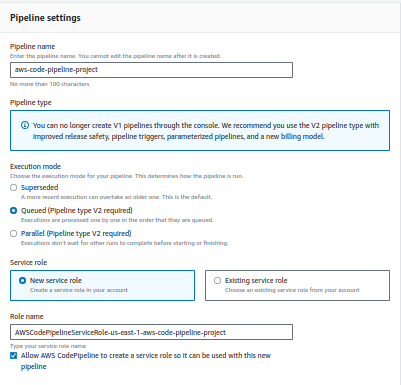

# AWS CodePipeline Project

This project demonstrates the use of AWS CodePipeline with three main components: GitHub Repository, CodeBuild, and CodeDeploy.

I have hosted a simple React application on an EC2 instance using an Application Load Balancer. The GitHub repository code will be continuously integrated and continuously deployed using AWS CodePipeline.




This README will guide you through setting up CodeBuild and CodeDeploy.


## Github Repository 
This github repository contains code for simple react app. It contains two essential files ***buildspec.yml*** and ***appspec.yml*** which will be used by CodeBuild and CodeDeploy respectively.


**buildspec.yml**  
```
version: 0.2

phases:
  install:
    on-failure: ABORT
    commands:
      - sudo apt update -y
      - curl -sL https://deb.nodesource.com/setup_20.x -o /tmp/nodesource_setup.sh
      - sh /tmp/nodesource_setup.sh
      - sudo apt install nodejs -y
      - node -v

  pre_build:
    on-failure: ABORT
    commands:
      - npm ci

  build:
    on-failure: ABORT
    commands:
      - npm run build
      - cp -r appspec.yml .htaccess build/

artifacts:
  files:
    - "./*"
  base-directory: build/

```

## CodeBuild


#### 1. Create CodeBuild Project
Begin by navigating to the CodeBuild service in the AWS Management Console.


#### 2. Enter Name
Provide a name for your CodeBuild project.


#### 3. Add Source as GitHub and Connect Using OAuth
Select **GitHub** as your source provider. Click the **Connect using OAuth** button, log in to your GitHub account, and allow access.
After that select Github Repository. In **Source Version** add Branch Name to build for commits on specific branch.


After Allowing Access to AWS , Navigate in Github account **Setting > Integrations > Applications** , you should be able to see AWS Connector.


#### 4. Configure Primary Source Webhook Events
Select the checkbox to rebuild every time a code change is pushed to the repository. Set the build type to **Single build**.


#### 5. Select Environment
Choose the appropriate environment for your build. You can select a managed image or provide a custom Docker image.

Please note that while selecting VPC Configuration please select Subnets with NAT Access as Code Build Does not Assign Public to Build Agents, it will give error while Dowloading Source Code and Uploading Artifacts.


#### 6. Buildspec
As We have already added buildspec.yml in our github repository, we will select **use buildspec file**. If your file is not in root path , please enter appropriate path.


#### 7. Select Artifacts to S3
We are going to zip our artifacts to an S3 bucket so choose Amazon S3 as the location to store your build artifacts. Provide the S3 bucket name and the artifact name. I have specified name as `code.zip` and path as `\`.


#### 8. Enable Logs
Enable CloudWatch logs to monitor the build process.


#### After Setting up CodeBuild Start Build to build status and check whether artifacts are getting stored on S3.


## CodeDeploy

In this project we are going to deploy our React code on EC2 Agent using Apache2 HTTP Server. 

### Prerequisites
#### 1. Autoscaling Group with CodeDeploy Agent Running : 

Use Following User Data with your autoscaling to run CodeDeploy Agent in your EC2 Instances: 
```
#!/bin/bash
apt update -y
apt install apache2 ruby-full ruby-webrick wget curl  -y
apt upgrade -y
systemctl enable apache2
systemctl start apache2
TOKEN=`curl -X PUT "http://169.254.169.254/latest/api/token" -H "X-aws-ec2-metadata-token-ttl-seconds: 21600"`
INSTANCE_IDENTITY=$(curl -H "X-aws-ec2-metadata-token: $TOKEN" http://169.254.169.254/latest/dynamic/instance-identity/document)
REGION=$(echo $INSTANCE_IDENTITY | grep -oP '(?<="region" : ")[^"]+')
wget https://aws-codedeploy-$REGION.s3.$REGION.amazonaws.com/latest/install
chmod +x ./install
./install auto > /tmp/logfile
```
Please refer [here](https://docs.aws.amazon.com/autoscaling/ec2/userguide/create-asg-launch-template.html) if you don't know how to create an Autoscaling Group.

#### 2. Application Load Balancer atttached to Autoscaling Group 
Create an Application Load Balancer with HTTP Listener. Please refer [here](https://docs.aws.amazon.com/elasticloadbalancing/latest/application/create-application-load-balancer.html) for documentation. 

#### 3. Create a Service Role 
In AWS, service roles are used to grant permissions to an AWS service so it can access AWS resources. 

The service role you create for CodeDeploy must be granted the permissions required for your compute platform. 

For EC2/On-Premises deployments, attach the ***AWSCodeDeployRole*** policy. Add following trust policy to the service role :
```
{
    "Version": "2012-10-17",
    "Statement": [
        {
            "Sid": "",
            "Effect": "Allow",
            "Principal": {
                "Service": [
                    "codedeploy.amazonaws.com"
                ]
            },
            "Action": "sts:AssumeRole"
        }
    ]
}
```

Please refer [here](https://docs.aws.amazon.com/codedeploy/latest/userguide/getting-started-create-service-role.html) for further help 

### 1. Create Application 
Create application in CodeDeploy Dashboard.


### 2. Create A Deployment Group
A deployment group is the AWS CodeDeploy entity for grouping EC2 instances or AWS Lambda functions in a CodeDeploy deployment. In our case, it is a set of instances associated with our application i.e. autoscaling group that you target for a deployment.

We will select the service role that was created above. 
In Environment configuration, We will select **Autoscaling Group**. 

For Deployment type we will select In-Place. An in-place deployment updates instances with the latest application revision. A blue/green deployment registers a replacement set of instances for the deployment group with a load balancer and deregisters the original instances.


### 3. appspec.yml
After this setup is done we can add appspec.yml in our github repository.

The application specification file (AppSpec file) is a YAML formatted or JSON-formatted file used by CodeDeploy to manage a deployment. The AppSpec file for an EC2/On-Premises deployment must be named appspec. yml or appspec.yaml , unless you are performing a local deployment.

The appspec.yaml file is a configuration file that defines how the deployment should proceed. It specifies the deployment process, including which files should be deployed, where they should be deployed, and any scripts or hooks that should be executed during the deployment.

```
version: 0.0
os: linux
files:
  - source: /
    destination: /var/www/html
version: 0.0
os: linux
files:
  - source: /
    destination: /var/www/html
```

Our appspec.yml will copy all the artifacts to default Apache2 folder (/var/www/html).

We are copying our appspec.yml in our artifacts using buildspec.yml so that it will be available to our CodeDeploy agent when we fetch the Artifacts in our Agent.

#### 4. Create Deployment 
Create Deployment and specify the deployment group we created in earlier steps. 
Add S3 url of the zip created by CodeBuild in Revision Location so that appspec.yml will be used.


#### Check Deployment Status 


## CodePipeline

AWS Codepipeline will pull source code directly from `Github`. It will run build in `AWS CodeBuild` and will deploy changes using `AWS CodeDeploy`.

### Create Pipeline 

Specify pipeline name and select new service role. 



In order to use existing service role, please verify following permission and trust policy with the existing role. 

***Trust Policy*** 
```
{
    "Version": "2012-10-17",
    "Statement": [
        {
            "Effect": "Allow",
            "Principal": {
                "Service": "codepipeline.amazonaws.com"
            },
            "Action": "sts:AssumeRole"
        }
    ]
}
```
***Role Permissions*** 
```
{
  "Version": "2012-10-17",
  "Statement": [
    {
      "Effect": "Allow",
      "Action": [
        "codecommit:CancelUploadArchive",
        "codecommit:GetBranch",
        "codecommit:GetCommit",
        "codecommit:GetUploadArchiveStatus",
        "codecommit:UploadArchive"
      ],
      "Resource": "*"
    },
    {
      "Effect": "Allow",
      "Action": [
        "codedeploy:CreateDeployment",
        "codedeploy:GetApplicationRevision",
        "codedeploy:GetDeployment",
        "codedeploy:GetDeploymentConfig",
        "codedeploy:RegisterApplicationRevision"
      ],
      "Resource": "*"
    },
    {
      "Effect": "Allow",
      "Action": [
        "codebuild:BatchGetBuilds",
        "codebuild:StartBuild"
      ],
      "Resource": "*"
    },
    {
      "Effect": "Allow",
      "Action": [
        "devicefarm:ListProjects",
        "devicefarm:ListDevicePools",
        "devicefarm:GetRun",
        "devicefarm:GetUpload",
        "devicefarm:CreateUpload",
        "devicefarm:ScheduleRun"
      ],
      "Resource": "*"
    },
    {
      "Effect": "Allow",
      "Action": [
        "lambda:InvokeFunction",
        "lambda:ListFunctions"
      ],
      "Resource": "*"
    },
    {
      "Effect": "Allow",
      "Action": [
        "iam:PassRole"
      ],
      "Resource": "*"
    },
    {
      "Effect": "Allow",
      "Action": [
        "elasticbeanstalk:*",
        "ec2:*",
        "elasticloadbalancing:*",
        "autoscaling:*",
        "cloudwatch:*",
        "s3:*",
        "sns:*",
        "cloudformation:*",
        "rds:*",
        "sqs:*",
        "ecs:*"
      ],
      "Resource": "resource_ARN"
    }
  ]
}
```
### Add Source 
While Adding Source Select Github and Make Sure you have Github Creds Handy. Select Respository and enter default branch name i.e. main or master.


#### Trigger 
Select Event Type as ***PUSH*** as we want to trigger pipeline on each commit. 
To run it for a specific branch we shave elected filter type as Branch and included main branch.


### Build 
In the next step, Select ***AWS CodeBuild*** as build provider. Select the build project created in CodeBuild and move on to the next step.  


### Deploy 
In the Deploy stage, Select ***AWS CodeDeploy***. Add our CodeDeploy application name and deployment group. 


After Reviewing all the details create pipeline.

You can see pipeline status in console.


### Notification

You can also add notification to Slack or MS Teams using AWS Chatbot. Adding notification to SNS Topic will push message to multiple endpoints(such as AWS Lambda, Amazon SQS, HTTP/S, or an email address).


#### Thank you !!


